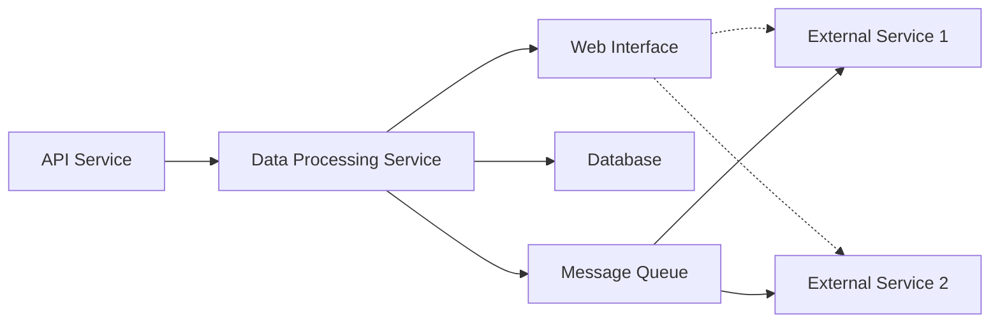

# Система электронной коммерции

## Общее описание

**1. API-сервис:**
API-сервис предоставляет набор API для покупателей и продавцов, позволяя производить покупки, управлять продуктами, отслеживать заказы и обмениваться информацией о доставке. Обрабатывает HTTP-запросы, связывается с базой данных для получения и обновления информации о продуктах и заказах, а также взаимодействует с внешними системами платежей и доставки.

**2. Сервис обработки данных:**
Сервис обработки данных отвечает за анализ и обработку данных о покупках, клиентах и продажах. Выполняет операции по агрегации данных, подсчету статистики, генерации отчетов и прогнозированию спроса.

**3. Веб-интерфейс:**
Веб-интерфейс предоставляет интерфейс для покупателей и продавцов, позволяя делать покупки, управлять аккаунтами, добавлять и редактировать продукты,  просматривать статистику о продажах и других действиях.

## Техническое описание

### Основные сервисы:

Система состоит из трех сервисов: API-сервиса, сервиса обработки данных и веб-интерфейса. Каждый сервис работает в своем отдельном контейнере, который запускается внутри Kubernetes.

**1. API-сервис:**
   - Компоненты: Deployment, Service, ConfigMap, Secret
   - Образ: api-service:v1
   - Назначение: предоставляет API для взаимодействия с системой, обрабатывает HTTP-запросы, взаимодействует с базой данных и сервисом очереди сообщений.

_Deployment_: Определяет шаблон подов для API-сервиса. Управляет запуском и масштабированием экземпляров подов в кластере. Мы настраиваем его для запуска контейнера с образом api-service:v1. Содержит requests и limits.

_Service_: Обеспечивает устойчивый доступ к API-сервису внутри кластера. Маршрутизирует входящие запросы к API-сервису по его имени. Другие сервисы в кластере будут обращаться к API-сервису, используя имя сервиса.

_ConfigMap_: Хранит конфигурационные данные для API-сервиса. Мы можем использовать ConfigMap для хранения переменных окружения, настроек, путей и другой конфигурации. API-сервис будет получать свою конфигурацию из ConfigMap.

_Secret_: Хранит конфиденциальные данные, такие как токены, пароли или ключи шифрования, которые API-сервис может использовать для аутентификации или других операций. Secret обеспечивает безопасное хранение этих конфиденциальных данных.

**2. Сервис обработки данных:**
   - Компоненты: Deployment, Job, CronJob, ConfigMap
   - Образ: data-processing-service:v1
   - Назначение: обрабатывает данные, выполняет вычисления и операции над ними в фоновом режиме. Регулярно запускает задачи для обработки данных, такие как вычисление статистики и генерация отчетов.

_Deployment_: Определяет шаблон подов для сервиса обработки данных. Deployment позволяет нам управлять запуском и масштабированием экземпляров подов, гарантируя наличие нужного количества экземпляров в кластере.

_Job_: Определяет задачу для сервиса обработки данных. Job обеспечивает запуск задач и контроль их выполнения. В нашем случае, Job запускает задачи по обработке данных, такие как вычисление статистики или генерация отчетов.

_ConfigMap_: Хранит конфигурационные данные для сервиса обработки данных.

_CronJob_: Запускает задачу обработки данных каждый час с использованием образа data-processing-service:v1. 

**3. Веб-интерфейс:**
   - Компоненты: Deployment, Service, Ingress
   - Образ: web-interface:v1
   - Назначение: предоставляет пользовательский интерфейс для системы, позволяет просматривать данные, управлять задачами и настраивать систему.

_Deployment_: Определяет шаблон подов для веб-интерфейса. Deployment управляет экземплярами подов веб-интерфейса, позволяя масштабировать и обновлять его по необходимости. 

_Service_: Обеспечивает доступ к веб-интерфейсу с помощью внутренней сети Kubernetes. Service маршрутизирует входящие запросы к веб-интерфейсу по имени сервиса, позволяя другим частям системы обращаться к веб-интерфейсу.

_Ingress_: Обеспечивает управление внешним доступом к веб-интерфейсу. Мы настроили Ingress для маршрутизации входящих запросов к веб-интерфейсу на основе правил, определенных в Ingress-ресурсе. Ingress может обработать балансировку нагрузки, SSL-терминацию и другие операции, чтобы внешние клиенты могли получить доступ к веб-интерфейсу.

### Внешние зависимости (вне K8s):

**1. Сервис базы данных:**
API-сервис использует базу данных для хранения информации о продуктах, заказах, клиентах и других сущностях.

 - База данных:
   - Порт: 5432
   - Сервер: db.example.com
   - Системные требования: 2 CPU, 4GB RAM, 100GB дисковое пространство

**2. REST сервисы:**
API-сервис взаимодействует с REST сервисами платежных шлюзов для обработки онлайн-платежей и с сервисами доставки для отслеживания статуса доставок.

Сервис 1: Сервис аутентификации и авторизации пользователей. Может обрабатывать запросы на регистрацию, вход, обновление пароля и другие операции, связанные с безопасностью и идентификацией пользователей.

   - Сервис 1:
     - Порт: 8000
     - Сервер: service1.example.com
     - Системные требования: 1 CPU, 2GB RAM, 20GB дисковое пространство

Сервис 2: Сервис для взаимодействия с инвентарем товаров. Он может предоставлять API для получения информации о наличии товаров, добавления новых товаров, обновления и удаления записей о товарах и других операций, связанных с управлением инвентарем.

   - Сервис 2:
     - Порт: 8080
     - Сервер: service2.example.com
     - Системные требования: 1 CPU, 1GB RAM, 10GB дисковое пространство

**3. Очередь сообщений:**
API-сервис использует очередь сообщений для асинхронной обработки платежей, заказов и доставок. Это позволяет улучшить производительность, надежность и отказоустойчивость системы при работе с внешними сервисами и повысить общую отзывчивость системы.

 - Очередь сообщений:
   - Порт: 5672
   - Сервер: messaging.example.com
   - Системные требования: 1 CPU, 2GB RAM, 20GB дисковое пространство

## Диаграмма системы:

